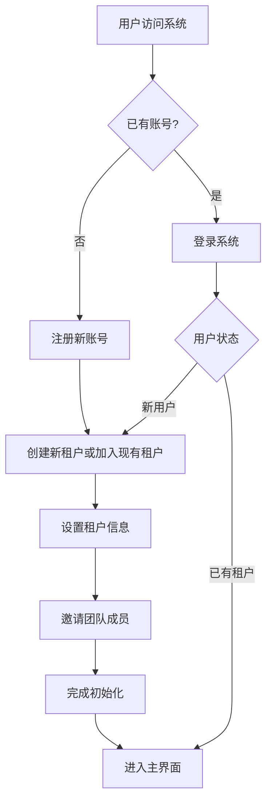
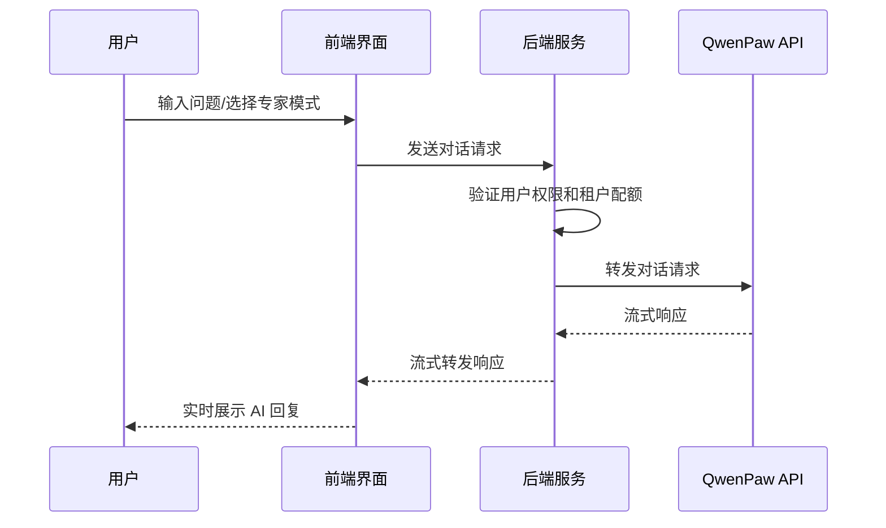
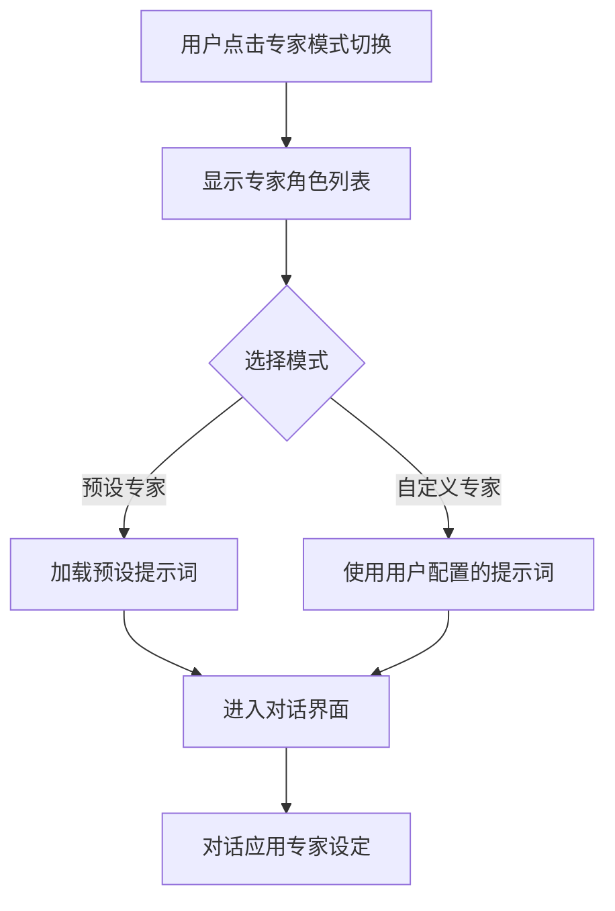

# WorkMate AI Agent 平台 - 产品需求文档

## 1. 产品概述

WorkMate 是一款基于 QwenPaw 的多租户 AI Agent 平台，旨在为企业团队提供安全、高效的智能助手服务。通过整合 QwenPaw 的强大 AI 能力，并借鉴 WorkBuddy 的优秀交互体验，特别是其"专家模式"，WorkMate 支持多个租户（团队/组织）共享使用，每个租户拥有独立的数据空间和用户管理体系。

核心价值：解决 QwenPaw 单用户限制问题，让团队成员能够协同使用 AI 助手，同时保持数据隔离和独立配置。

目标用户：企业内部团队、创业公司、自由职业者团队等需要多人协作使用 AI 的场景。

## 2. 核心功能

### 2.1 用户角色

| 角色 | 注册方式 | 核心权限 |
|------|----------|----------|
| 租户管理员 | 租户创建者，默认管理员 | 管理租户成员、配置租户设置、管理专家模式 |
| 团队成员 | 租户管理员邀请或自行注册 | 使用 AI 对话、管理个人设置 |
| 访客 | 受邀用户 | 仅限对话功能，权限受限 |

### 2.2 功能模块

1. **认证与授权模块**
   - 用户注册与登录（邮箱/密码）
   - 租户创建与管理
   - 角色权限管理
   - JWT Token 认证

2. **多租户管理模块**
   - 租户创建（组织名称、Logo、配置）
   - 租户成员管理（邀请、移除、角色分配）
   - 租户级配置（默认模型、对话限制、专家模式配置）

3. **AI 对话模块**
   - 基础对话界面（类似 WorkBuddy）
   - 流式响应展示
   - 对话历史管理
   - 会话收藏与标注

4. **专家模式模块**
   - 预设专家角色（技术顾问、产品经理、数据分析师等）
   - 自定义专家角色创建
   - 专家模式快捷切换
   - 专家角色提示词管理

5. **个人中心模块**
   - 用户资料管理
   - 对话偏好设置
   - 通知设置
   - API 使用统计

## 3. 核心流程

### 3.1 用户注册与租户创建流程

### 3.2 AI 对话流程

### 3.3 专家模式切换流程

## 4. 用户界面设计

### 4.1 设计风格

- **整体风格**：现代简洁、专业高效，参考 WorkBuddy 的设计语言
- **配色方案**：
  - 主色调：深蓝色 #1E40AF（专业、可信赖）
  - 辅助色：浅蓝色 #3B82F6
  - 强调色：橙色 #F97316（用于重要操作和提示）
  - 背景色：浅灰 #F8FAFC
  - 文字色：深灰 #1E293B
- **按钮样式**：圆角按钮，hover 有阴影效果
- **字体**：
  - 主字体：Inter（英文）/ 思源黑体（中文）
  - 代码字体：JetBrains Mono
- **布局风格**：左侧边栏 + 右侧主内容区的经典布局
- **图标风格**：Lucide Icons，简洁线条风格

### 4.2 页面设计概览

| 页面名称 | 模块名称 | UI 元素和设计 |
|---------|----------|---------------|
| 登录/注册页 | 表单区域 | 居中卡片式布局，Logo + 表单 + 社交登录选项 |
| 主对话页面 | 侧边栏 | 折叠式导航，新对话按钮，历史会话列表 |
| 主对话页面 | 对话区域 | 消息气泡（用户/AI 区分），流式输入框，发送按钮 |
| 主对话页面 | 专家模式面板 | 右侧滑出面板，专家角色卡片网格，切换开关 |
| 租户管理页面 | 成员管理表格 | 用户头像、姓名、角色、最后活跃时间、操作按钮 |
| 个人设置页面 | 表单卡片 | 分组表单，保存按钮，表单验证提示 |

### 4.3 响应式设计

- 桌面优先设计
- 平板适配：侧边栏自动折叠为图标模式
- 移动端适配：底部导航 + 全屏对话模式

## 5. 非功能性需求

### 5.1 性能需求

- 对话响应延迟：< 500ms（不计 QwenPaw 处理时间）
- 页面加载时间：< 2s
- 支持同时在线用户：100+ 每租户

### 5.2 安全需求

- 所有 API 使用 HTTPS
- JWT Token 有效期：24 小时
- 敏感数据加密存储
- 租户数据完全隔离

### 5.3 可用性需求

- 系统可用性：99.5%
- 数据备份：每日自动备份
- 错误恢复：自动重试机制

## 6. MVP 版本范围

### 优先实现（MVP）

1. ✅ 用户认证（注册/登录）
2. ✅ 租户创建和管理
3. ✅ 基础 AI 对话功能
4. ✅ 专家模式（预设角色）
5. ✅ 简单的个人设置

### 后续迭代

- 自定义专家角色创建
- 高级权限管理
- 对话数据分析
- 第三方集成
