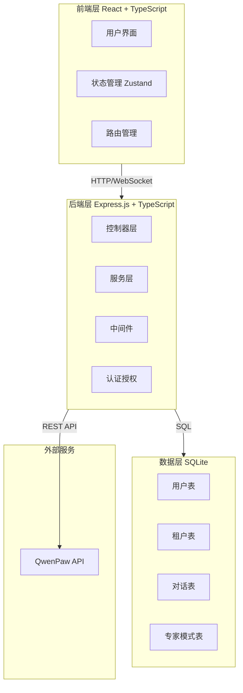
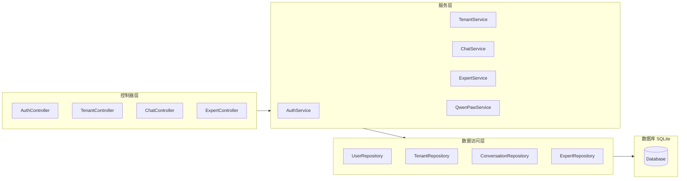
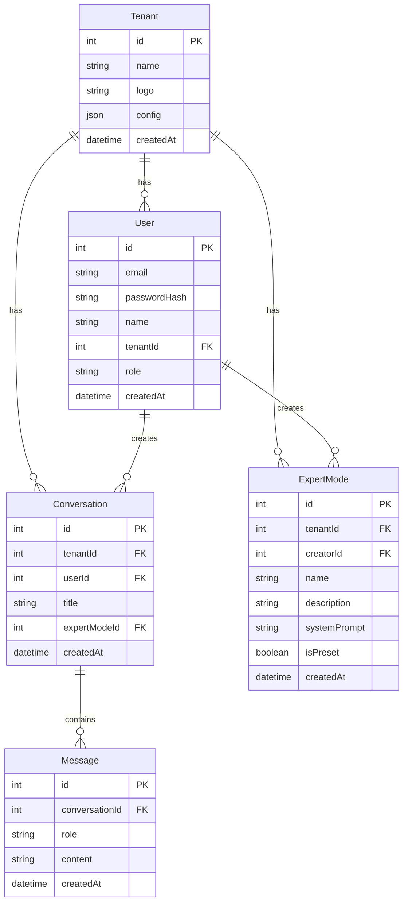

# WorkMate AI Agent 平台 - 技术架构文档

## 1. 技术架构设计

### 1.1 系统架构图



## 2. 技术选型说明

### 2.1 前端技术栈

- **框架**：React 18 + TypeScript
- **构建工具**：Vite
- **路由管理**：React Router DOM v6
- **状态管理**：Zustand
- **样式方案**：Tailwind CSS
- **HTTP 客户端**：Axios
- **UI 组件**：Lucide React（图标）+ 自定义组件

### 2.2 后端技术栈

- **运行环境**：Node.js 18+
- **框架**：Express.js 4
- **语言**：TypeScript
- **数据库**：SQLite（轻量级，易于部署）
- **ORM**：Better-SQLite3（高性能）
- **认证**：JWT + bcrypt
- **验证**：express-validator

### 2.3 初始化命令

```bash
# 使用 pnpm 初始化项目
pnpm create vite-init@latest . --template react-express-ts --force
```

## 3. 路由定义

### 3.1 前端路由

| 路由路径 | 页面名称 | 功能描述 |
|---------|----------|----------|
| `/` | 首页 | 登录/注册页面 |
| `/dashboard` | 主对话页面 | AI 对话主界面 |
| `/dashboard/experts` | 专家模式页面 | 管理专家角色 |
| `/admin/tenants` | 租户管理页面 | 管理租户成员 |
| `/settings` | 个人设置 | 用户偏好设置 |

### 3.2 后端 API

#### 认证接口

| 方法 | 路径 | 功能 |
|------|------|------|
| POST | `/api/auth/register` | 用户注册 |
| POST | `/api/auth/login` | 用户登录 |
| POST | `/api/auth/logout` | 用户登出 |
| GET | `/api/auth/me` | 获取当前用户信息 |

#### 租户管理接口

| 方法 | 路径 | 功能 |
|------|------|------|
| POST | `/api/tenants` | 创建租户 |
| GET | `/api/tenants` | 获取用户所属租户 |
| PUT | `/api/tenants/:id` | 更新租户信息 |
| DELETE | `/api/tenants/:id` | 删除租户 |
| GET | `/api/tenants/:id/members` | 获取租户成员 |
| POST | `/api/tenants/:id/members` | 添加租户成员 |
| DELETE | `/api/tenants/:id/members/:userId` | 移除租户成员 |

#### AI 对话接口

| 方法 | 路径 | 功能 |
|------|------|------|
| POST | `/api/chat` | 发送对话请求 |
| GET | `/api/conversations` | 获取对话历史 |
| GET | `/api/conversations/:id` | 获取单个对话详情 |
| DELETE | `/api/conversations/:id` | 删除对话 |

#### 专家模式接口

| 方法 | 路径 | 功能 |
|------|------|------|
| GET | `/api/experts` | 获取专家模式列表 |
| POST | `/api/experts` | 创建自定义专家模式 |
| PUT | `/api/experts/:id` | 更新专家模式 |
| DELETE | `/api/experts/:id` | 删除专家模式 |

## 4. API 接口定义

### 4.1 认证接口

#### POST /api/auth/register

**请求体：**

```typescript
interface RegisterRequest {
  email: string;
  password: string;
  name: string;
  tenantName?: string; // 可选，创建新租户
}
```

**响应：**

```typescript
interface AuthResponse {
  success: boolean;
  data: {
    user: User;
    token: string;
    tenant?: Tenant;
  };
}
```

### 4.2 对话接口

#### POST /api/chat

**请求体：**

```typescript
interface ChatRequest {
  message: string;
  conversationId?: string;
  expertModeId?: string;
}
```

**响应（流式）：**

```typescript
interface ChatStreamResponse {
  conversationId: string;
  messageId: string;
  content: string; // 流式传输
  expertMode?: ExpertMode;
  timestamp: number;
}
```

## 5. 服务端架构

### 5.1 分层架构图



### 5.2 核心服务说明

#### QwenPawService

负责与 QwenPaw API 的集成：

```typescript
interface QwenPawConfig {
  baseUrl: string;      // QwenPaw 服务地址
  apiKey?: string;      // API 密钥（可选）
  timeout: number;     // 超时设置
}

interface ChatMessage {
  role: 'user' | 'assistant';
  content: string;
}

interface QwenPawRequest {
  messages: ChatMessage[];
  stream?: boolean;
  temperature?: number;
  maxTokens?: number;
}
```

## 6. 数据模型

### 6.1 ER 图



### 6.2 数据定义语言

```sql
-- 用户表
CREATE TABLE users (
    id INTEGER PRIMARY KEY AUTOINCREMENT,
    email TEXT UNIQUE NOT NULL,
    password_hash TEXT NOT NULL,
    name TEXT NOT NULL,
    tenant_id INTEGER,
    role TEXT DEFAULT 'member',
    created_at DATETIME DEFAULT CURRENT_TIMESTAMP,
    FOREIGN KEY (tenant_id) REFERENCES tenants(id)
);

-- 租户表
CREATE TABLE tenants (
    id INTEGER PRIMARY KEY AUTOINCREMENT,
    name TEXT NOT NULL,
    logo TEXT,
    config TEXT DEFAULT '{}',
    created_at DATETIME DEFAULT CURRENT_TIMESTAMP
);

-- 对话表
CREATE TABLE conversations (
    id INTEGER PRIMARY KEY AUTOINCREMENT,
    tenant_id INTEGER NOT NULL,
    user_id INTEGER NOT NULL,
    title TEXT,
    expert_mode_id INTEGER,
    created_at DATETIME DEFAULT CURRENT_TIMESTAMP,
    FOREIGN KEY (tenant_id) REFERENCES tenants(id),
    FOREIGN KEY (user_id) REFERENCES users(id)
);

-- 消息表
CREATE TABLE messages (
    id INTEGER PRIMARY KEY AUTOINCREMENT,
    conversation_id INTEGER NOT NULL,
    role TEXT NOT NULL,
    content TEXT NOT NULL,
    created_at DATETIME DEFAULT CURRENT_TIMESTAMP,
    FOREIGN KEY (conversation_id) REFERENCES conversations(id)
);

-- 专家模式表
CREATE TABLE expert_modes (
    id INTEGER PRIMARY KEY AUTOINCREMENT,
    tenant_id INTEGER NOT NULL,
    creator_id INTEGER,
    name TEXT NOT NULL,
    description TEXT,
    system_prompt TEXT NOT NULL,
    is_preset INTEGER DEFAULT 0,
    created_at DATETIME DEFAULT CURRENT_TIMESTAMP,
    FOREIGN KEY (tenant_id) REFERENCES tenants(id)
);

-- 索引
CREATE INDEX idx_users_tenant ON users(tenant_id);
CREATE INDEX idx_conversations_tenant ON conversations(tenant_id);
CREATE INDEX idx_messages_conversation ON messages(conversation_id);
CREATE INDEX idx_expert_modes_tenant ON expert_modes(tenant_id);
```

## 7. 预设专家模式

系统提供以下预设专家模式：

| ID | 名称 | 描述 | 系统提示词 |
|----|------|------|-----------|
| 1 | 技术顾问 | 编程、架构、技术问题解答 | 你是资深技术顾问，擅长解答编程问题、系统架构设计、性能优化等技术问题... |
| 2 | 产品经理 | 产品需求分析、PRD 撰写 | 你是经验丰富的产品经理，擅长需求分析、PRD 撰写、用户研究... |
| 3 | 数据分析师 | 数据处理、统计、可视化 | 你是专业数据分析师，擅长数据处理、统计分析、数据可视化建议... |
| 4 | 创意写作 | 内容创作、文案撰写 | 你是创意写作专家，擅长各类文案创作、内容策划... |
| 5 | 英语翻译 | 中英互译、翻译润色 | 你是专业翻译，擅长中英互译，提供地道流畅的翻译... |

## 8. 配置说明

### 8.1 环境变量配置

```env
# 数据库配置
DATABASE_PATH=./data/workmate.db

# JWT 配置
JWT_SECRET=your-secret-key
JWT_EXPIRES_IN=24h

# QwenPaw 配置
QWENPAW_BASE_URL=http://localhost:8000
QWENPAW_API_KEY=
QWENPAW_TIMEOUT=30000

# 服务配置
PORT=3000
NODE_ENV=development
```

### 8.2 QwenPaw 集成说明

QwenPaw API 集成采用 HTTP 客户端直连方式：

- **基础 URL**：内网部署的 QwenPaw 地址
- **认证方式**：Header 携带 Token（可选）
- **请求格式**：OpenAI Chat API 兼容格式
- **响应格式**：支持流式（SSE）和非流式响应
- **错误处理**：超时重试、连接失败降级

## 9. 项目目录结构

```
/workspace
├── src/                      # 前端源码
│   ├── components/          # 通用组件
│   ├── pages/               # 页面组件
│   ├── hooks/               # 自定义 Hooks
│   ├── stores/              # Zustand 状态管理
│   ├── api/                 # API 请求
│   ├── types/               # TypeScript 类型
│   └── utils/               # 工具函数
├── api/                      # 后端源码
│   ├── controllers/         # 控制器
│   ├── services/            # 服务层
│   ├── repositories/        # 数据访问层
│   ├── middleware/          # 中间件
│   ├── routes/              # 路由定义
│   ├── types/               # 类型定义
│   └── utils/               # 工具函数
├── data/                     # 数据库文件
├── migrations/               # 数据库迁移脚本
├── .trae/documents/         # 项目文档
├── package.json
├── tsconfig.json
└── vite.config.ts
```
